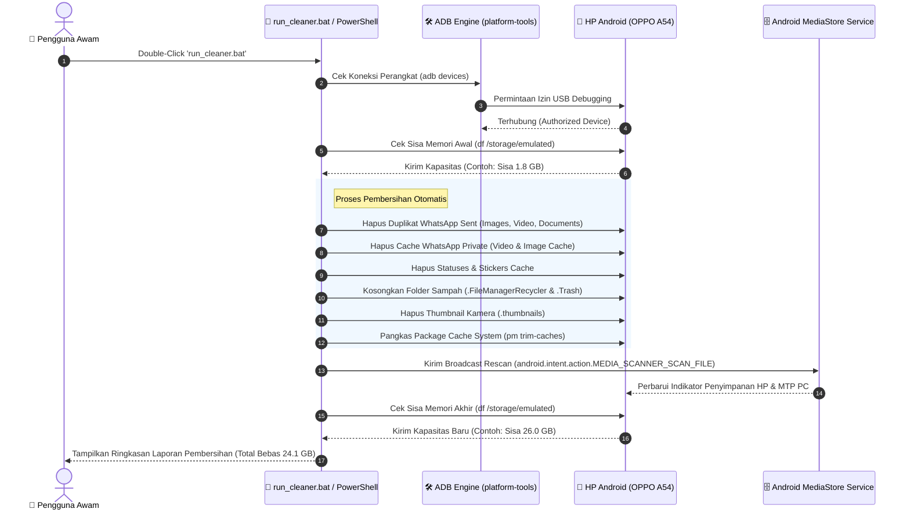

# 📱 Android ADB Storage Cleaner - Visual Guide Carousel

Dokumen ini berisi kode Markdown Carousel interaktif untuk petunjuk penggunaan dan diagram alur Android ADB Storage Cleaner.

````carousel
### 📱 Slide 1: Ringkasan & Hasil Pembersihan (OPPO A54)

> [!NOTE]
> **Solusi Otomatis Mengosongkan 10GB - 25GB+ Memori Internal HP Android yang Penuh Tanpa Menghapus Foto & Video Pribadi Penting.**

#### 📊 Perbandingan Penyimpanan (Studi Kasus OPPO A54):
| Parameter | Sebelum Pembersihan | Sesudah Pembersihan | Hasil |
| :--- | :--- | :--- | :--- |
| **Penyimpanan Terpakai** | 103.05 GB (99% Penuh) | **79.00 GB (76%)** | 🔻 **Berkurang 24.1 GB** |
| **Sisa Ruang Kosong (Avail)** | **1.89 GB** | **26.00 GB** | 🚀 **BEBAS 26 GB KOSONG** |

- 💬 **WhatsApp Sent & Private Cache**: ~18.2 GB duplikat foto/video terkirim & private cache
- 🎬 **WhatsApp Videos**: ~7.7 GB video mp4 dari grup/chat
- 🗑️ **Trash & Thumbnails**: ~1.5 GB sampah galeri `.FileManagerRecycler` & `.thumbnails`

<!-- slide -->
### 🔄 Slide 2: Diagram Urutan Alur Kerja (Sequence Diagram)



<!-- slide -->
### 📍 Slide 3: Langkah 1 - Aktifkan USB Debugging di HP

> [!TIP]
> Langkah ini hanya dilakukan **1 kali saja** di awal agar PC mendapatkan izin pembersihan.

1. Buka menu **Pengaturan (Settings)** di HP Android Anda.
2. Pilih menu **Tentang Ponsel (About Phone)**.
3. Cari menu **Versi / Nomor Kompilasi (Build Number)**.
4. **Ketuk 7 kali berturut-turut** hingga muncul pesan *"Anda adalah seorang pengembang!"*.
5. Kembali ke **Pengaturan** -> **Pengaturan Tambahan** -> **Opsi Pengembang**.
6. Aktifkan sakelar **Penataan USB (USB Debugging)** ke posisi **ON**.

<!-- slide -->
### 📍 Slide 4: Langkah 2 - Izinkan Akses USB Debugging pada HP

> [!IMPORTANT]
> Pastikan layar HP aktif dan tidak terkunci saat menghubungkan kabel USB ke laptop.

1. Hubungkan HP ke laptop/PC menggunakan **Kabel Data USB**.
2. Buka kunci layar HP (PIN / Pola).
3. Saat muncul pop-up konfirmasi:
   > 💬 **"Izinkan Penataan USB?"** *(Allow USB Debugging?)*
4. Centang **"Selalu izinkan dari komputer ini"** *(Always allow from this computer)*.
5. Tekan tombol **OK / Izinkan**.

<!-- slide -->
### 🚀 Slide 5: Langkah 3 - Jalankan Pembersihan 1-Klik

Cukup gunakan salah satu metode pembersihan di bawah ini:

#### Opsi 1: Double-Click Batch File (Paling Mudah)
Buka folder proyek dan klik ganda file:
- `run_cleaner.bat`

#### Opsi 2: Perintah PowerShell Terminal
```powershell
# Pembersihan otomatis penuh (WhatsApp Sent/Private, Trash, Thumbnails):
powershell -ExecutionPolicy Bypass -File .\clean_android.ps1 -AutoCleanAll

# Hapus seluruh video WhatsApp (VID-*.mp4):
powershell -ExecutionPolicy Bypass -File .\clean_whatsapp_videos.ps1 -DeleteAllVideos

# Pindai cache aplikasi & video besar:
powershell -ExecutionPolicy Bypass -File .\scan_apps_and_whatsapp.ps1
```

<!-- slide -->
### 🛡️ Slide 6: Jaminan Keamanan & Kebijakan File

> [!TIP]
> **Apakah foto & video penting di galeri saya akan terhapus?**
> **TIDAK.** Pembersihan HANYA menyasar file duplikat tersembunyi `Sent`, cache temporary `Private`, folder tempat sampah `.FileManagerRecycler`, dan file thumbnail `.thumbnails`. Seluruh foto & video asli hasil kamera di Galeri Anda **100% AMAN**.

> [!NOTE]
> **Kompatibilitas Perangkat:**
> Kompatibel penuh dengan seluruh merk HP Android (OPPO, Samsung, Xiaomi, Redmi, POCO, Vivo, Realme, Infinix, Asus, dll).
````
