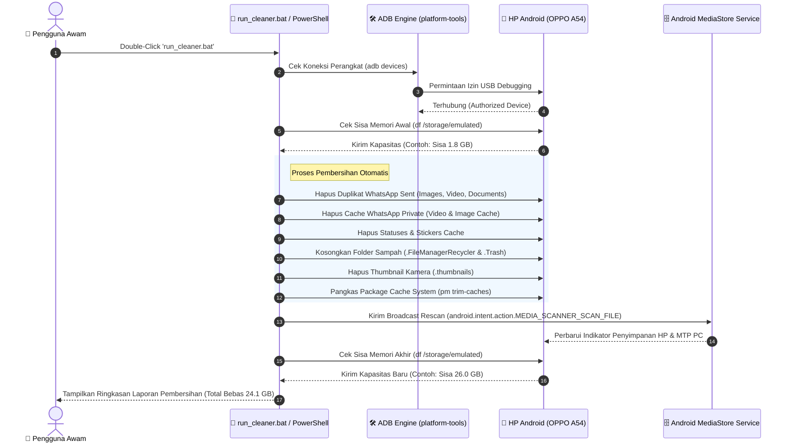

# 📱 Android ADB Storage Cleaner (Pembersih Memori HP Android)

> **Solusi Otomatis Mengosongkan 10GB - 25GB+ Memori Internal HP Android yang Penuh Tanpa Menghapus Foto & Video Pribadi Penting.**

---

## 📖 Tentang Proyek (About Description)

**Android ADB Storage Cleaner** adalah alat pembersih otomatis ringan berbasis PowerShell dan **ADB (Android Debug Bridge)** yang dirancang untuk mengatasi masalah *"Penyimpanan Internal Penuh (99%)"* pada HP Android (OPPO, Samsung, Xiaomi, Vivo, Realme, dll).

### 🔍 Mengapa Memori HP Android Sering Tiba-Tiba Penuh?
Banyak pengguna Android tidak menyadari bahwa sistem penyimpanan Android menyimpan puluhan gigabyte file tersembunyi yang tidak terlihat di galeri biasa:
- **Duplikat Media Terkirim WhatsApp (`Sent`)**: Setiap kali Anda mengirim foto, video, atau dokumen di WhatsApp, WhatsApp membuat **salinan duplikat** di folder rahasia `Sent`.
- **Cache Video & Foto Tersembunyi (`Private`)**: Cache pemutaran video dan gambar temporary WhatsApp yang mendekam hingga belasan GB.
- **Folder Sampah Tempat Sampah (`Recently Deleted / Recycler`)**: Foto/video yang sudah Anda hapus dari Galeri sebenarnya **tidak langsung hilang**, melainkan disimpan di tempat sampah internal (`.FileManagerRecycler`) selama 30 hari.
- **Cache Thumbnail Kamera (`.thumbnails`)**: File kecil pratinjau gambar yang menumpuk hingga ber-gigabyte.

Alat ini secara otomatis memindai dan membersihkan seluruh file sampah tersembunyi tersebut langsung dari PC/Laptop melalui kabel USB secara aman dan cepat.

---

## 📊 Hasil Uji Coba Real-Time (Studi Kasus: OPPO A54)

| Parameter | Sebelum Pembersihan | **Sesudah Pembersihan** | Peningkatan |
| :--- | :--- | :--- | :--- |
| **Penyimpanan Terpakai** | 103.05 GB (99% Penuh) | **79.00 GB (76%)** | 🔻 **Berkurang 24.1 GB** |
| **Sisa Ruang Kosong (Avail)** | **1.89 GB** | **26.00 GB** | 🚀 **BEBAS 26 GB KOSONG** |
| **Total Ruang Dibersihkan** | - | **~24.1 GB** | 🎉 **Sangat Lega!** |

---

## 🔄 Alur Kerja Sistem (Sequence Diagram)

Berikut adalah diagram urutan proses pembersihan dari PC ke HP Android menggunakan Mermaid.js:



---

## 📘 Panduan Cara Pakai Lengkap (Untuk Orang Awam)

Tidak perlu paham pemrograman! Cukup ikuti **3 langkah mudah** di bawah ini:

### 📍 Langkah 1: Aktifkan "Penataan USB" (USB Debugging) di HP Anda

> [!NOTE]
> Langkah ini hanya perlu dilakukan **1 kali saja** di awal agar laptop/PC mendapat izin membersihkan sampah di HP.

1. Buka menu **Pengaturan (Settings)** di HP Android Anda.
2. Gulir ke bawah dan pilih **Tentang Ponsel (About Phone)**.
3. Cari menu **Versi / Nomor Kompilasi (Build Number)**.
4. **Tekan / Ketuk menu tersebut sebanyak 7 kali berturut-turut** hingga muncul pesan *"Anda sekarang adalah seorang pengembang!"*.
5. Kembali ke menu utama **Pengaturan** -> pilih **Pengaturan Tambahan (Additional Settings)** -> pilih **Opsi Pengembang (Developer Options)**.
6. Cari tombol **Penataan USB (USB Debugging)** lalu nyalakan sakelarnya ke posisi **ON**.

---

### 📍 Langkah 2: Hubungkan HP ke PC & Izinkan Akses

1. Hubungkan HP Anda ke Laptop/PC menggunakan **Kabel Data USB**.
2. Buka kunci layar HP Anda (masukkan PIN/Pola).
3. Di layar HP akan muncul jendela konfirmasi pop-up bertuliskan:
   > 💬 **"Izinkan Penataan USB?"** *(Allow USB Debugging?)*
4. Centang opsi **"Selalu izinkan dari komputer ini"** *(Always allow from this computer)*, lalu tekan tombol **OK / Izinkan**.

---

### 📍 Langkah 3: Jalankan Pembersih 1-Klik

1. Buka folder [android-cleaner](file:///d:/Shiddiqcode/android-cleaner) di komputer Anda.
2. Klik ganda (Double-Click) pada file **[run_cleaner.bat](file:///d:/Shiddiqcode/android-cleaner/run_cleaner.bat)**.
3. Jendela hitam perintah akan terbuka dan secara otomatis membersihkan semua sampah memori.
4. Tunggu hingga muncul tulisan **"CLEANUP COMPLETED!"**. Selesai! 🎉

> [!TIP]
> **Tips Jika Indikator Memori di Windows Explorer Belum Berubah:**
> Apabila batang indikator memori di PC masih berwarna merah setelah pembersihan, **cabut kabel USB lalu colokkan kembali** ke laptop Anda. Tampilan memori di PC akan langsung berubah menjadi lega (bebas belasan/puluhan GB).

---

## 📂 Struktur File Proyek

```text
android-cleaner/
├── clean_android.ps1           # Script utama pembersih sampah Android & WhatsApp
├── clean_whatsapp_videos.ps1   # Script khusus pembersih file video WhatsApp (VID-*.mp4)
├── scan_apps_and_whatsapp.ps1  # Script pemindai cache aplikasi & video grup WhatsApp
├── run_cleaner.bat             # Launcher 1-Click Batch Script untuk Pengguna Umum
├── download_adb.ps1            # Script downloader otomatis Android Platform-Tools (ADB)
├── .gitignore                  # Berkas pengabaian versi git
└── README.md                   # Dokumentasi petunjuk pemakaian & diagram
```

---

## ❓ FAQ (Pertanyaan yang Sering Diajukan)

> [!IMPORTANT]
> **Apakah foto & video penting di galeri saya akan terhapus?**
> **TIDAK.** Script ini dirancang sangat aman. Script HANYA menghapus file duplikat otomatis di folder `Sent`, file cache sementara `Private`, folder tempat sampah yang sudah Anda hapus sebelumnya, dan file thumbnail temporary. Foto & video asli hasil kamera di Galeri Anda **100% AMAN**.

> [!TIP]
> **Apakah aman digunakan di HP Android merk selain OPPO?**
> **SANGAT AMAN.** Script ini kompatibel dengan seluruh perangkat Android seperti Samsung, Xiaomi, Redmi, POCO, Vivo, Realme, Infinix, Asus, Motorola, dll.
